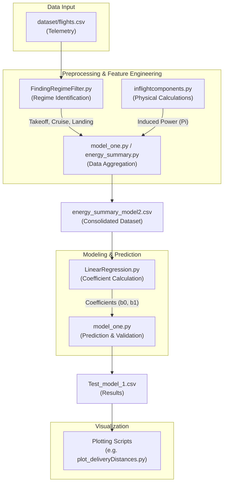

# Energy Consumption Analysis and Prediction for Drone-Based Package Delivery

This repository contains a suite of Python scripts for analyzing and predicting the energy consumption of drones during package delivery missions. The methodology combines physical modeling (e.g., induced power) with statistical methods (linear regression) to estimate energy needs across different flight phases.

## 🚀 Overview

The project processes high-frequency telemetry data from drone flights to:
1.  **Identify Flight Regimes**: Automatically detect takeoff, cruise, and landing phases using altitude-time profiles and Gaussian filtering.
2.  **Calculate Physical Components**: Compute induced power and other energy-related metrics based on flight dynamics and environmental conditions.
3.  **Model Energy Consumption**: Train a linear regression model that correlates physical power requirements with measured battery usage.
4.  **Validate Predictions**: Estimate energy consumption for test flights and evaluate accuracy using Average Relative Error (ARE).

## 📊 Workflow Flowchart

Below is the high-level workflow of the data processing and modeling pipeline:



## 📂 Project Structure

| File | Description |
| :--- | :--- |
| `dataset/` | Contains raw flight data (`flights.csv`) and processed results. |
| `model_one.py` | Main script for energy summary generation, modeling, and validation. |
| `LinearRegression.py` | Implementation of the linear regression model used for prediction. |
| `FindingRegimeFilter.py` | Preprocessing script to filter altitude data and split flights into regimes. |
| `inflightcomponents.py` | Physical models for calculating induced power and other components. |
| `airdensity.py` | Utility to calculate air density based on altitude and environment. |
| `inducedVelocity.py` | Physics model for induced velocity calculations. |
| `plot_*.py` | Various scripts for generating figures (e.g., flight regimes, regressions). |

## 🛠️ Installation & Dependencies

Ensure you have Python 3.x installed. The following libraries are required:

```bash
pip install pandas numpy scipy matplotlib seaborn
```

## 📖 Usage

### 1. Generate Energy Summary
To process the raw flight data and create an energy summary:
```bash
python model_one.py
```
This will generate `energy_summary_model2.csv` if it doesn't already exist.

### 2. Run Modeling and Analysis
The `model_one.py` script also performs the full modeling pipeline:
- Splitting data into "poll" (training) and test sets.
- Calculating regression coefficients via `LinearRegression.py`.
- Computing Average Relative Error (ARE) and saving results to `Test_model_1.csv`.

### 3. Visualization
You can run individual plotting scripts to visualize the results:
```bash
python plot_deliveryDistances.py
```

## 📈 Results
The current model evaluates accuracy using the **Average Relative Error (ARE)** metric, providing a robust measure of how closely predicted energy consumption matches measured values across different payloads and speeds.
