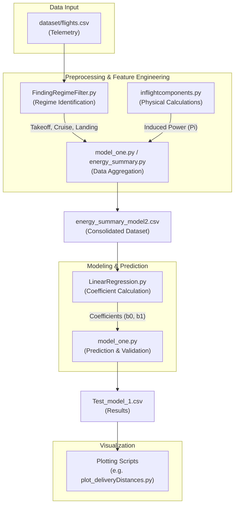

# Energy Consumption Analysis and Prediction for Drone-Based Package Delivery

This repository contains a suite of Python scripts for analyzing and predicting the energy consumption of drones during package delivery missions. The methodology combines physical modeling (e.g., induced power) with statistical methods (linear regression) to estimate energy needs across different flight phases.

## 🚀 Overview

The project processes high-frequency telemetry data from drone flights to:
1.  **Identify Flight Regimes**: Automatically detect takeoff, cruise, and landing phases using altitude-time profiles and Gaussian filtering.
2.  **Calculate Physical Components**: Compute induced power and other energy-related metrics based on flight dynamics and environmental conditions.
3.  **Model Energy Consumption**: Train a linear regression model that correlates physical power requirements with measured battery usage.
4.  **Validate Predictions**: Estimate energy consumption for test flights and evaluate accuracy using Average Relative Error (ARE).

## 📊 Workflow Flowchart

Below is the high-level workflow of the data processing and modeling pipeline:



## 📂 Project Structure

The project has been organized into a modular structure for better maintainability:

```text
energy_consumption/
├── dataset/             # Raw flight telemetry and input data
├── src/                 # Source code
│   ├── core/            # Physics-based models (air density, power functions)
│   ├── processing/      # Data cleaning and flight regime identification
│   ├── modeling/        # Regression models and energy estimation logic
│   ├── visualization/   # Scripts for generating figures and plots
│   └── utils/           # External API utilities (METAR data)
├── results/             # Outputs generated by the scripts
│   ├── figures/         # Generated PDF/PNG plots
│   └── tables/          # Processed CSV summaries and model parameters
├── main.py              # Entry point to run the analysis pipeline
└── README.md            # Project documentation
```

## 🛠️ Installation & Dependencies

Ensure you have Python 3.x installed. The following libraries are required:

```bash
pip install pandas numpy scipy matplotlib seaborn geopy metar
```

## 📖 Usage

### ⚙️ Run the Entire Pipeline
The easiest way to run the analysis is via the `main.py` entry point in the root directory:
```bash
python main.py
```
This script ensures all directories exist, sets up the Python path, and runs the full analysis pipeline.

### 🧪 Running Individual Modules
You can also run modules individually using the `-m` flag from the project root:
```bash
# Run the modeling logic
python -m src.modeling.model_one

# Run a visualization script
python -m src.visualization.plot_deliveryDistances
```

## 📈 Results
Processed data and visualizations are saved in the `results/` directory. The primary metric for model evaluation is the **Average Relative Error (ARE)**, which measures the accuracy of predicted energy consumption against actual measured values.
